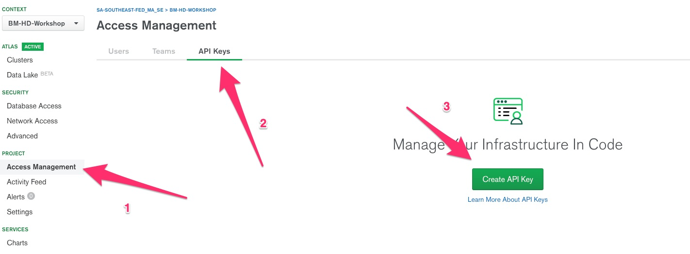
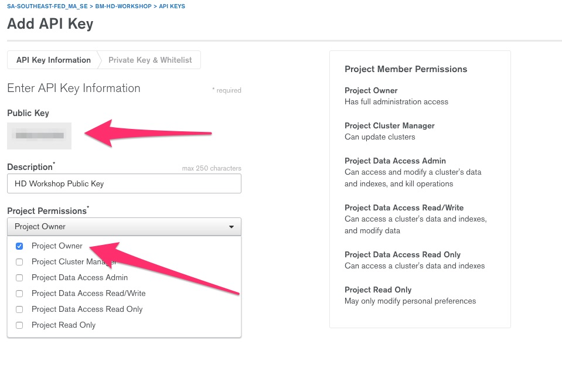
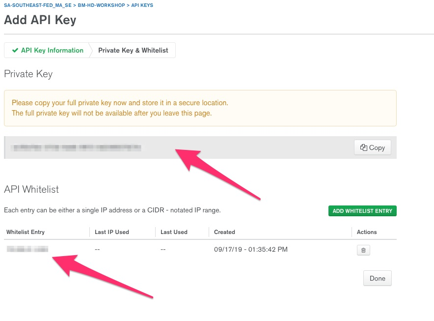
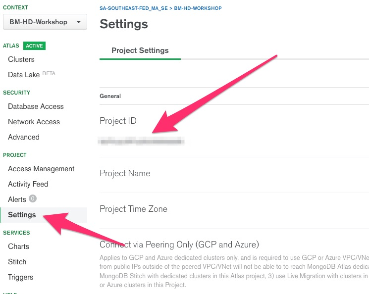
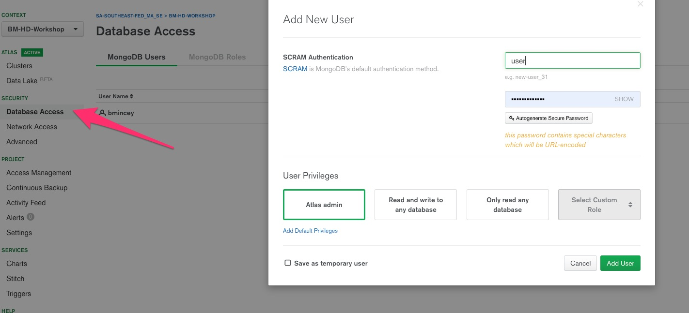

# mongodb-pov-workshop1
First in series of PoVs of MongoDB Atlas capabilities.
This workshop will cover the following examples:

* Auto Deploy
* Scale up
* Rolling Updates
* Pause Cluster

## Python3 Requirements
```pip3 install requests``` 

```pip3 install python-dotenv ``` 

```pip3 install pymongo```
 
```pip3 install asyncio```
 

## Pre-Requisites (other than an Atlas Account)
### Generate API Key






### Copy the Project ID (numeric value and not character string or name)


### Create an Atlas Admin user 


## Additional notes on each exercise
### Auto Deploy

### Scale up

### Rolling Updates

### Pause Cluster

